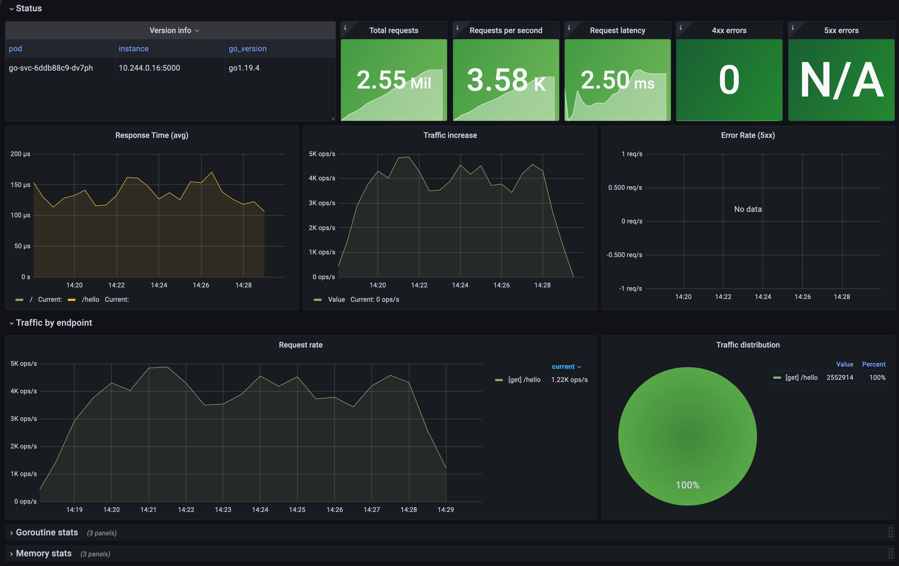
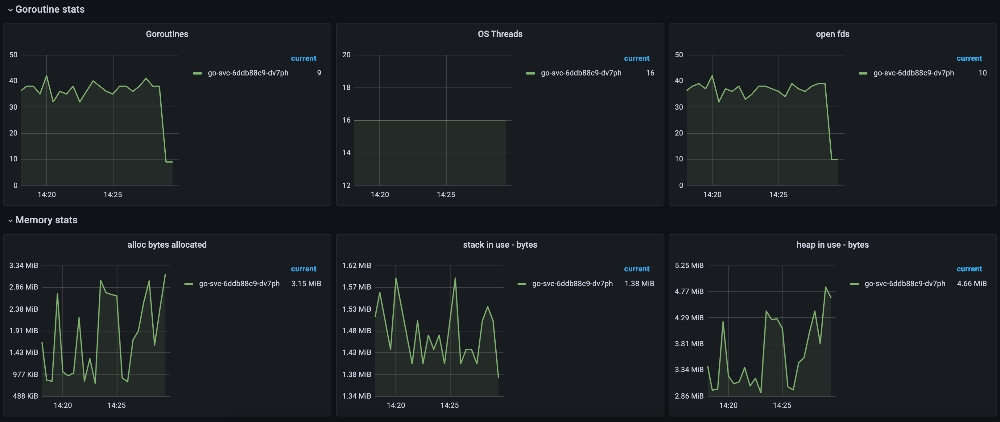

# go-svc

Template for building services in Go.

## Features

- [x] Minimum dependencies service template
- [x] Structure logging with [zerolog](https://github.com/rs/zerolog)
- [x] [Prometheus](https://prometheus.io/) [metrics](./pkg/httpe/metrics/)
- [x] [Admin endpoints](./pkg/httpe/admin/routes.go) on separate port
- [x] HTTP [response helpers](./pkg/httpe/response.go)
- [x] HTTP chainable [middlewares](./pkg/httpe/middleware.go)
- [x] Dockerfile and Kubernetes deployments
- [x] Local development with [Tilt](https://tilt.dev/) and [Kind](https://kind.sigs.k8s.io/)
- [ ] Github Actions
- [x] [Grafana dashboard](./deploy/go-svc/dashboards/go-svc.json) deployed to Grafana from config map

## Sample requests

Requests for:

1. [Sample service](service.http)
1. [Admin service](admin.http)

Can be run directly from VS Code using [Rest Client](https://marketplace.visualstudio.com/items?itemName=humao.rest-client).

## Kubernetes

Setting up local Kubernetes environment is easy.

Make sure you have [Kind](https://kind.sigs.k8s.io/) installed:

```shell
brew install kind
```

Setup local cluster:

```shell
./hack/kind.sh
```

Run tilt - this will deploy go-svc along with [kube-prometheus-stack](https://github.com/prometheus-community/helm-charts/tree/main/charts/kube-prometheus-stack) for monitoring:

```shell
tilt up
```

## Dashboard

Example dashboard is deployed to Grafana from [config map](./deploy/go-svc/kustomization.yaml).

Traffic stats:


Goroutine & memory stats:

